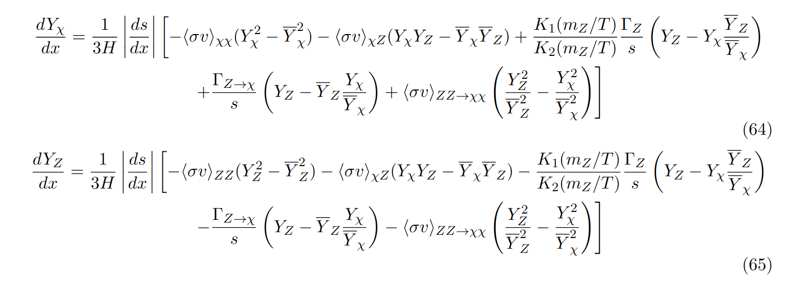
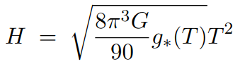

## Installation

In order to compute the number density for an specific model, it is necessary to:

 1. Instal MadGraph with MadDM
 2. Copy the files [MadDM/get_taacs.f](./MadDM/get_taacs.f), [MadDM/maddm.f](./MadDM/maddm.f) and [MadDM/makefile](MadDM/makefile)  to ``MG5/PLUGIN/maddm/Templates/src/``.

The above steps can also be done running [installer.sh](./installer.sh)

## Computing thermally averaged cross-secions

To compute the $\langle \sigma v \rangle$ for the necessary processes run:

 1. Run MadDM on your command prompt, with the desired model.
   
By running MadDM with the new files, it will generate two new files in the output directory (MG5 > bin > (model just created) > output), names 'taacs.csv' and 'processes_taacs.csv'. These files contain the data for all the possible annihilations reactions in the model, and their respective cross-sections averaged over the temperature.

## Computing Decay Widths

4. Run MadGraph on your command prompt, for the desired model. It is important to alter the width of all the decaying particles in model to 'auto', so MadGraph will compute their decay width and the possible decays in the param_card.

## Solving the Boltzmann Equations

5. Download all the files on the main directory.

(main_test e test são dois notebooks que estou usando para rodar o programa, ou para testar algumas alterações antes de implementá-las. coloquei eles no diretório para não perder, caso ocorra algum problema com meu computador. eles não são necessários para o programa)

### Input Parameters

On modelParameters, input all the necessary information. They are:
 1. ``nsteps``: the number of steps the code will use to interpolate the cross-sections over the temperature. The higher nsteps, the better the approximation for the cross-sections, but it will require more time to run the code.

 2. ``T_i`` and ``T_f``: the limiting values of temperature that should be used for the data, in GeV.

 3. ``taacs_path``: the path, in your device, for the 'taacs.csv' file

 4. ``processes_path``: the path, in your device, for the 'processes_taacs.csv' file

 5. ``param_path``: the path, in your device, for the 'param_card' file OBTAINED FROM MADGRAPH (not the one obtained from MadDM. By using the MadDM param_card, the decay reactions will not be computed)

 6. ``pnames``: a matrix with all the BSM particles included in the model. Each line of the matrix should be dedicated for one particle. First, it is necessary to input the label of each particle. It is important to note that only one particle should be labeled 'DM', which is the particle that will be used to compute the values of x (m_DM/T). Next, input the type of the particle, as used in the MadDM model, as a string (e.g. 'xd' for a Dirac fermion, 'ul' for the left-handed scalar partner of the up quark), and then the PDG code of the particle. Lastly, we have a parameter called 'in_equilibrium'. If the particle is initially in thermal equilibrium with the plasma, in_equilibrium must be 1 (as for a freeze-out model). If the particle's number density is virtually zero at T_i, in_equilibrium must be 0 (as for a freeze-in model).

 7. ``debug_version``: boolean that turns on and off the production of a 'debug file'. In it, it is printed the values for each term in the Boltzmann Equation divided by Hubble, separated by reaction, for each value of x computed. We know a reaction cease to alter the number density of a particle when its term in the Boltzmann Equation is comparable to the Hubble rate. Hence, in the debug file, a reaction cease to be relevant when BT/H \approx 1 (BT is the Boltzmann term).

 8. ``name_file``: name that should be used to save the files, as a string.

To run the code from a separated python/jupyter notebook file, it is necessary to use 'from boltzSolver import Y'. To run it directly from the command prompt, it is necessary to run the boltzSolver file, which will automatically run the other necessary files.

### Equations

    

    

